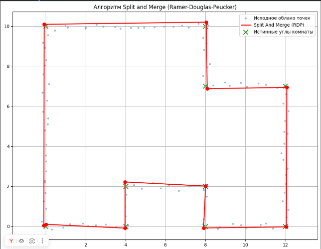
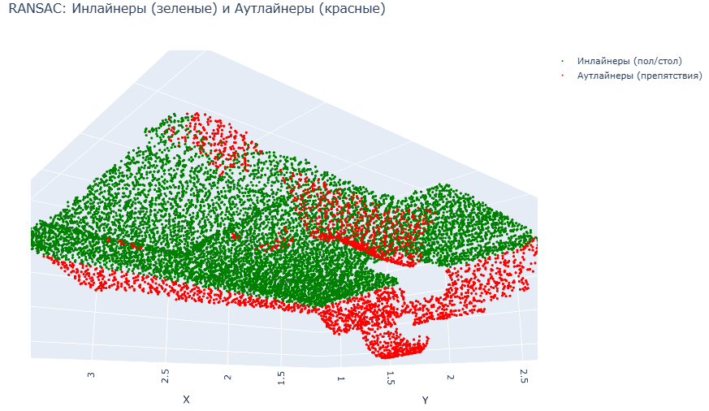

# Домашнее задание 1: Обнаружение стен и плоскости пола

**Advanced Robotics | Домашнее задание 1**

---

## 📌 Обзор

В рамках домашнего задания реализованы два алгоритма компьютерного зрения для робототехники:

1. **Обнаружение стен (2D LIDAR + Split and Merge)** — детектирование прямых линий в облаке точек 2D-лидара
2. **Обнаружение плоскости пола (RANSAC)** — выделение плоскости пола в 3D облаке точек

---

# Часть 1: Обнаружение стен (2D LIDAR)

## 🏗️ Методология

### 1. Генерация синтетических данных

Создана модель комнаты сложной формы с добавлением гауссовского шума:

**Вершины комнаты:**
```
(0,0) → (0,10) → (8,10) → (8,7) → (12,7) → (12,0) → (8,0) → (8,2) → (4,2) → (4,0)
```

**Параметры генерации:**
- Шаг между точками: **0.4** единицы
- Уровень шума: **σ = 0.1**
- Количество сгенерированных точек: **1138**

```python
def make_walls(vertex, body, step=0.4, scale=0.1):
    # Генерация точек стен с интерполяцией и добавлением шума
```

### 2. Алгоритм Split and Merge (Ramer-Douglas-Peucker)

Алгоритм RDP используется для выделения прямых сегментов (стен) из зашумленного облака точек:

**Принцип работы:**
1. Аппроксимация всего набора точек одной прямой
2. Поиск точки с максимальным отклонением от этой прямой
3. Если отклонение превышает порог ε, рекурсивное разделение на две части
4. Слияние точек, лежащих на одной прямой

```python
def split_and_merge(points, epsilon=0.5):
    # Рекурсивное разделение и слияние точек
```

**Параметр ε = 0.5** — максимальное расстояние от точки до аппроксимирующей линии.

---

## 📊 Результаты (Часть 1)

### Результат Split and Merge (RDP)



*Результат работы алгоритма Split and Merge:*
- *Синие кружки — исходные точки*
- *Красные линии — найденные стены*
- *Красные кружки — ключевые точки*
- *Зеленые крестики — истинные углы комнаты*

**Результаты сжатия:**
| Параметр | Значение |
|----------|----------|
| Исходное количество точек | 1138 |
| Количество ключевых точек | 11 |
| Сжатие | **99.03%** |
| Обнаружено стен | 11 |

---

### 🚫 Проблема с преобразованием Хафа

В ходе работы была предпринята попытка использовать классическое преобразование Хафа:

```python
tested_angles = np.linspace(-np.pi / 2, np.pi / 2, 360)
h, theta, d = hough_line(image_walls, theta=tested_angles)
hspace, angles, dists = hough_line_peaks(h, theta, d, threshold=len(walls)*0.1)
```

**Результат:**
```
Найдено 0 линий.
```

**Причины неудачи:**
- Высокий порог обнаружения (114 голосов) оказался слишком большим
- Разреженность точек и шум размывают пики в пространстве параметров
- Реализация `skimage.transform.hough_line` чувствительна к толщине линий и разрешению изображения

**Решение:** Использование алгоритма Split and Merge, который работает напрямую с точками и не требует растеризации.

---

# Часть 2: Обнаружение плоскости пола (RANSAC)

## 🏗️ Методология

### Алгоритм RANSAC для поиска плоскости

RANSAC (Random Sample Consensus) используется для выделения плоскости пола в 3D облаке точек. Алгоритм работает следующим образом:

1. **Случайная выборка** — выбираются 3 случайные точки из облака
2. **Построение гипотезы** — по выбранным точкам вычисляется плоскость
3. **Оценка гипотезы** — подсчитывается количество точек, лежащих на расстоянии меньше порога от плоскости
4. **Итерация** — процесс повторяется `max_trials` раз
5. **Выбор лучшей** — выбирается плоскость с максимальным количеством инлайнеров

```python
def ransac_plane(points, distance_threshold=0.03, max_trials=1000):
    best_inliers = []
    for _ in range(max_trials):
        # Случайный выбор 3 точек
        idx = random.sample(range(num_points), 3)
        p1, p2, p3 = points[idx]
        
        # Вычисление параметров плоскости
        v1 = p2 - p1
        v2 = p3 - p1
        normal = np.cross(v1, v2)
        normal = normal / np.linalg.norm(normal)
        d = -np.dot(normal, p1)
        
        # Подсчет инлайнеров
        distances = np.abs(np.dot(points, normal) + d)
        inliers = np.where(distances < distance_threshold)[0]
        
        if len(inliers) > len(best_inliers):
            best_inliers = inliers
    
    return best_inliers
```

**Параметры алгоритма:**
- `distance_threshold = 0.03` — порог расстояния до плоскости (метры)
- `max_trials = 1000` — количество итераций

### Данные

Используется пример облака точек из библиотеки Open3D (PCDPointCloud):
- Количество точек: **11367** (после даунсэмплинга)
- Размерность: **3D**
- Источник: Open3D example dataset

---

## 📊 Результаты (Часть 2)

### Визуализация результатов RANSAC


*3D визуализация: зеленые точки — плоскость пола/стола, красные точки — препятствия*

### Статистика детектирования

| Параметр | Значение |
|----------|----------|
| Всего точек | 11,367 |
| Найдено инлайнеров (пол/стол) | 8,793 |
| Процент инлайнеров | **77.4%** |
| Процент аутлайнеров (препятствия) | 22.6% |

### Чувствительность к параметрам

**Влияние количества итераций (max_trials):**

| max_trials | Результат (кол-во инлайнеров) |
|------------|------------------------------|
| 10 | 7,292 - 8,868 |
| 1000 | 8,830 |

**Вывод:** Увеличение количества итераций повышает стабильность и качество результата. При малом количестве итераций (10) результат сильно варьируется (от 7292 до 8868 точек).

---

## 📈 Сравнительный анализ методов

| Критерий | Split and Merge (2D) | RANSAC (3D) |
|----------|---------------------|-------------|
| **Размерность** | 2D | 3D |
| **Цель** | Сжатие данных, выделение стен | Обнаружение плоскости пола |
| **Устойчивость к шуму** | Высокая | Высокая |
| **Вычислительная сложность** | O(n log n) | O(k·n) |
| **Требуемые параметры** | ε (порог отклонения) | Порог расстояния, итерации |
| **Гарантия результата** | Всегда находит | Зависит от итераций |

---

## 🎯 Выводы

### По части 1 (Обнаружение стен):

1. **Преобразование Хафа не подошло** для данной задачи из-за разреженности точек и шума
2. **Алгоритм Split and Merge (RDP) показал отличные результаты**:
   - Обнаружены все 11 стен комнаты
   - Ключевые точки совпадают с истинными углами
   - Сжатие данных на 99% при сохранении геометрии

### По части 2 (Обнаружение пола):

1. **RANSAC успешно выделил плоскость пола** (77.4% точек)
2. **Количество итераций критически влияет** на стабильность результата
3. **Порог расстояния 0.03** оптимален для данного облака точек
4. **3D визуализация** позволяет наглядно оценить качество сегментации

### Общие выводы:

1. **Выбор метода зависит от характера данных**:
   - Hough Transform — для плотных данных и изображений
   - Split and Merge — для разреженных зашумленных 2D данных
   - RANSAC — для выделения плоскостей в 3D

2. **Адаптация параметров критически важна** для получения качественных результатов

---

## 📁 Структура проекта

```
homework_1/
├── README.md                              # Этот файл
├── wall_detection.ipynb                   # Jupyter notebook с кодом
└── wall_results/
    ├── 1_original_points.png              # Исходное облако точек (2D)
    ├── 2_split_and_merge_result.png       # Результат Split and Merge (2D)
    └── 3_ransac_3d.png                    # Результат RANSAC (3D)
```

---

## 🚀 Как запустить

1. **Установите зависимости:**
   ```bash
   pip install numpy matplotlib scikit-image open3d plotly
   ```

2. **Запустите Jupyter notebook:**
   ```bash
   jupyter notebook wall_detection.ipynb
   ```

3. **Выполните все ячейки последовательно**

4. **Результаты сохранятся** в папку `wall_results/`

---

## 📚 Источники

- [Ramer-Douglas-Peucker algorithm](https://en.wikipedia.org/wiki/Ramer–Douglas–Peucker_algorithm)
- [Hough Transform](https://en.wikipedia.org/wiki/Hough_transform)
- [RANSAC algorithm](https://en.wikipedia.org/wiki/Random_sample_consensus)
- [Open3D Documentation](http://www.open3d.org/docs/release/)

---

## 👨‍💻 Автор

**Advanced Robotics Course**  
*Домашнее задание 1 - Обнаружение стен и плоскости пола*

---

*Последнее обновление: Март 2026*
```

## 📋 Что нужно сделать:

1. **Создай папку** `wall_results/` в репозитории
2. **Помести туда три скриншота:**
   - `1_original_points.png` — исходное облако точек (первый график)
   - `2_split_and_merge_result.png` — результат Split and Merge (второй график)
   - `3_ransac_3d.png` — 3D результат RANSAC (скриншот из Plotly)

3. **Скопируй README.md** в корень репозитория

Готово! 🔥
