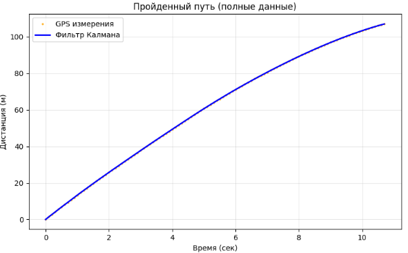

# Домашнее задание 2: Оценка пройденного пути (Linear Kalman Filter)

**Advanced Robotics | Домашнее задание 2**

---

## 📌 Обзор

В данном задании реализован **линейный фильтр Калмана** для оценки пройденного пути путем слияния данных GPS и акселерометра. В качестве источника данных использован **KITTI dataset**.

**Цель:** Объединить шумные измерения GPS и акселерометра для получения более точной оценки пройденного пути.

---

## 🏗️ Математическая модель

### Вектор состояния

```
x = [position, velocity]ᵀ
```

### Модель движения

**Матрица перехода состояния:**
```
A = [[1, dt],
     [0, 1]]
```

**Матрица управления:**
```
B = [[0.5 * dt²],
     [dt]]
```

где `dt = 0.1 с` — временной шаг (10 Гц).

### Матрица наблюдения

```
H = [[1, 0]]
```

---

## 📊 Данные

### Источник: KITTI Dataset

| Параметр | Значение |
|----------|---------|
| Количество записей | 108 |
| Частота | 10 Гц |
| Общая дистанция по GPS | 107.11 м |

### Параметры шума

| Параметр | Значение |
|----------|---------|
| Шум GPS (std_meas) | 0.0655 м |
| Шум акселерометра (std_acc) | 0.1289 м/с² |

---

## 📈 Результаты

### График 1: Полный путь


*Сравнение GPS измерений и фильтра Калмана*

### График 2: Начальный участок


*Детальный вид начала движения*

### График 3: Ошибка фильтрации


*Разница между GPS и оценкой фильтра Калмана*

### График 4: Оценка скорости


*Сравнение оценок скорости*

---

## 📊 Результаты фильтрации

| Метрика | Значение |
|---------|----------|
| Итоговая дистанция по GPS | 107.11 м |
| Итоговая дистанция по KF | 107.08 м |
| Разница в конечной точке | 0.04 м |
| Средняя абсолютная ошибка (MAE) | 0.04 м |
| Среднеквадратичная ошибка (RMSE) | 0.04 м |

---

## 🎯 Выводы

1. **Фильтр Калмана успешно сгладил шум GPS** — ошибка составила всего 4 см на дистанции 107 метров
2. **Оценка скорости** получилась гладкой и физически обоснованной
3. **Высокое качество исходных данных** (шум GPS 6.5 см) позволило достичь отличных результатов
4. **Метод показал эффективность** для задачи слияния GPS и инерциальных данных

---

## 📁 Структура проекта

```
homework_2/
├── README.md
├── kalman_filter.ipynb
├── kf_results.csv
└── kf_results/
    ├── 1_full_path.png
    ├── 2_initial_segment.png
    ├── 3_error.png
    └── 4_velocity.png
```

---

## 🚀 Как запустить

```bash
pip install numpy pandas matplotlib geopy
jupyter notebook kalman_filter.ipynb
```

---

## 📚 Источники

- [KITTI Vision Benchmark Suite](https://www.cvlibs.net/datasets/kitti/)
- [Kalman Filter — Wikipedia](https://en.wikipedia.org/wiki/Kalman_filter)

---

## 👨‍💻 Кудинов Руслан

**Advanced Robotics Course**  
*Домашнее задание 2*

---

*Последнее обновление: Март 2026*
```
