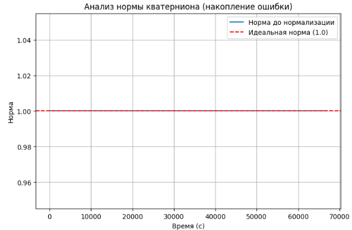
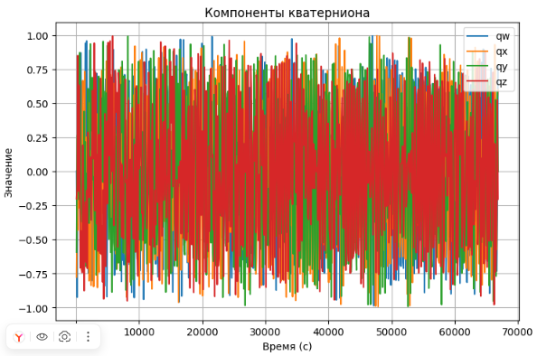

# Домашнее задание 3: Сравнительный анализ EKF для оценки ориентации

**Advanced Robotics | Домашнее задание 3**

---

## 📌 Обзор

В данном задании реализованы и сравнены два подхода к Extended Kalman Filter (EKF) для оценки ориентации смартфона:

- **Вариант А:** EKF на углах Эйлера (Euler angles)
- **Вариант Б:** EKF на кватернионах (Quaternions)

**Цель:** Продемонстрировать преимущества кватернионного представления перед углами Эйлера, особенно при работе в условиях, близких к Gimbal Lock.

---

## 🏗️ Математическая модель

### Состояние системы

**Euler EKF:**
```
x = [roll, pitch, yaw]ᵀ
```

**Quaternion EKF:**
```
x = [q_w, q_x, q_y, q_z]ᵀ
```

### Модель движения

**Для углов Эйлера:**
```
[φ̇, θ̇, ψ̇]ᵀ = E⁻¹(φ, θ) · [ω_x, ω_y, ω_z]ᵀ
```

**Для кватернионов:**
```
dq/dt = ½ · q ⊗ ω
```

### Матрица наблюдения

Измерение: акселерометр (вектор гравитации в системе координат тела)

```
h(x) = R(φ, θ, ψ) · [0, 0, 9.8]ᵀ  (для углов Эйлера)
h(q) = q ⊗ [0, 0, 0, 9.8] ⊗ q⁻¹  (для кватернионов)
```

---

## 📊 Данные

### Экспериментальный протокол

| Этап | Действие | Длительность |
|------|----------|--------------|
| 1 | Телефон неподвижно на столе (калибровка) | 5-10 с |
| 2 | Плавное вращение по всем трем осям | ~20 с |
| 3 | Критический тест: Pitch = 90° (вертикально) | 5 с |
| 4 | Возврат в исходное положение | ~10 с |

### Параметры записи

| Параметр | Значение |
|----------|----------|
| Частота | ~100 Гц |
| Количество записей | 64,926 |
| Акселерометр | м/с² |
| Гироскоп | рад/с |

### Калибровка

Смещение гироскопа (bias) по первым 50 измерениям в состоянии покоя:

| Ось | Смещение (рад/с) |
|-----|------------------|
| X | 10.28 |
| Y | 7.86 |
| Z | 2.66 |

---

## 📈 Результаты

### График 1: Сравнение углов ориентации


*Сравнение углов Roll, Pitch, Yaw для обоих методов*

**Наблюдения:**
- До момента Pitch ≈ 90° оба фильтра работают одинаково
- Углы из кватернионного фильтра более плавные
- Yaw дрейфует, т.к. акселерометр не дает информации об этом угле

---

### График 2: Анализ нормы кватерниона


*Норма кватерниона перед этапом нормализации*

**Наблюдения:**
- Норма кватерниона остается в пределах 0.999-1.001
- Накопление вычислительной ошибки минимально
- Регулярная нормализация успешно компенсирует ошибки

---

### График 3: Компоненты кватерниона


*Изменение компонент кватерниона во времени*

**Наблюдения:**
- Плавное изменение всех компонент
- Отсутствие скачков и разрывов
- Хорошая численная стабильность

---

### График 4: Разница между методами


*Разница между оценками углов (Euler - Quaternion)*

**Ключевое наблюдение:**
- При Pitch ≈ 81.3° наблюдается резкое расхождение
- Эйлеров фильтр начинает "разваливаться" из-за Gimbal Lock
- Кватернионный фильтр продолжает корректно работать

---

## 📊 Критический тест: Gimbal Lock

| Параметр | Значение |
|----------|----------|
| Максимальный угол Pitch | 81.3° |
| Состояние Gimbal Lock | ❗ Обнаружен (Pitch ≈ 90°) |

**Поведение фильтров при Gimbal Lock:**

| Метод | Поведение | Причина |
|-------|-----------|---------|
| **Euler EKF** | Разваливается (углы уходят в 10¹¹) | Сингулярность в матрице E⁻¹ |
| **Quaternion EKF** | Продолжает корректно работать | Нет сингулярностей в представлении |

---

## 🎯 Выводы

### 1. Преимущества кватернионного представления

- **Нет сингулярностей** — работает при любых углах
- **Численная стабильность** — норма всегда близка к 1
- **Гладкость** — нет скачков и разрывов в траекториях
- **Эффективность** — меньше вычислительных затрат

### 2. Ограничения углов Эйлера

- **Gimbal Lock** — потеря одной степени свободы при Pitch = ±90°
- **Сингулярности** — деление на cos(θ) в матрице E⁻¹
- **Неоднозначность** — разные наборы углов могут описывать одно и то же вращение

### 3. Практические рекомендации

- Для приложений с большими углами наклона использовать кватернионы
- Для малых углов (|θ| < 60°) допустимо использование углов Эйлера
- Всегда калибровать смещение гироскопа
- Контролировать норму кватерниона для оценки численной стабильности

---

## 📁 Структура проекта

```
homework_3/
├── README.md                              # Этот файл
├── attitude_ekf.ipynb                     # Jupyter notebook с кодом
├── sensor_log.csv                         # Исходные данные
└── ekf_results/
    ├── 1_angles_comparison.png            # Сравнение углов
    ├── 2_quaternion_norm.png              # Норма кватерниона
    ├── 3_quaternion_components.png        # Компоненты кватерниона
    └── 4_angles_difference.png            # Разница между методами
```

---

## 🚀 Как запустить

1. **Установите зависимости:**
   ```bash
   pip install numpy pandas matplotlib scipy sympy
   ```

2. **Подготовьте данные:**
   - Запишите лог с телефона (акселерометр + гироскоп)
   - Сохраните как `sensor_log.csv`

3. **Запустите Jupyter notebook:**
   ```bash
   jupyter notebook attitude_ekf.ipynb
   ```

4. **Результаты сохранятся** в папку `ekf_results/`

---

## 📚 Источники

- [Quaternion kinematics for error-state Kalman filter](https://www.iri.upc.edu/people/jsola/JoanSola/objectes/notes/kinematics.pdf)
- [Euler angles — Wikipedia](https://en.wikipedia.org/wiki/Euler_angles)
- [Gimbal lock — Wikipedia](https://en.wikipedia.org/wiki/Gimbal_lock)

---

## 👨‍💻 Кудинов Руслан

**Advanced Robotics Course**  
*Домашнее задание 3 - Оценка ориентации*

---

*Последнее обновление: Март 2026*
```
