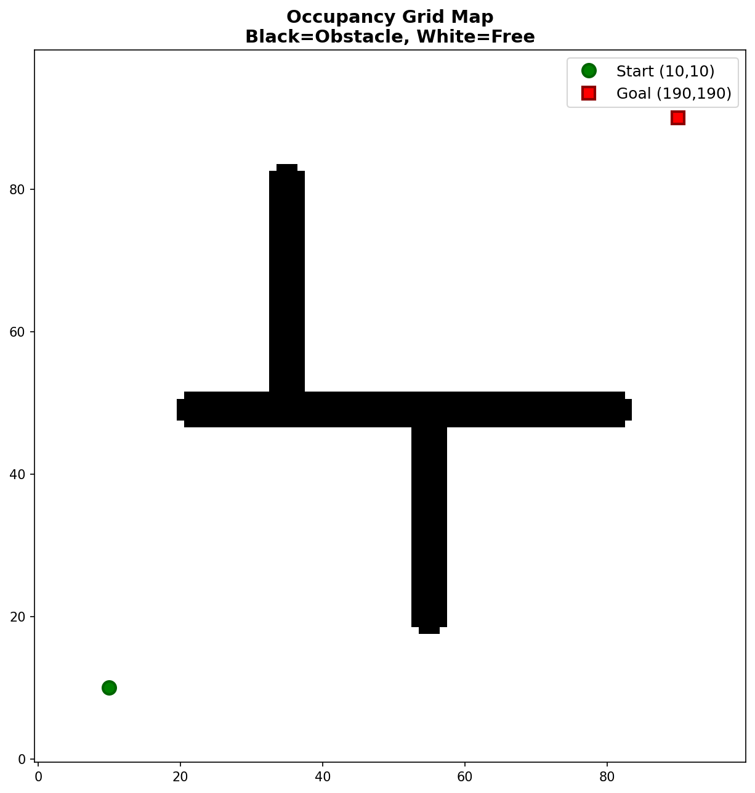
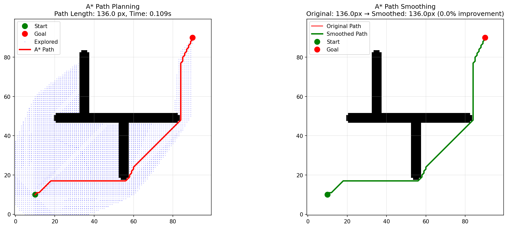
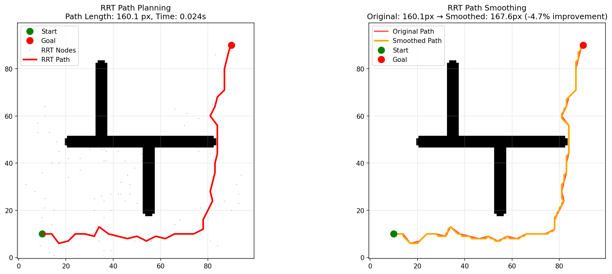
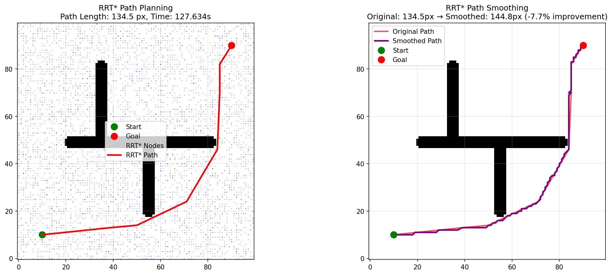
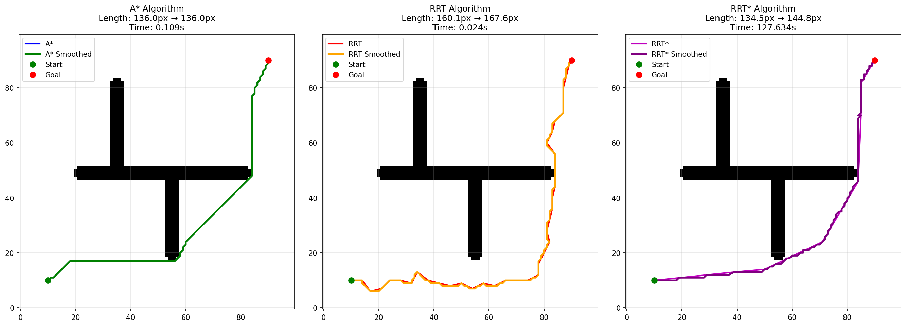
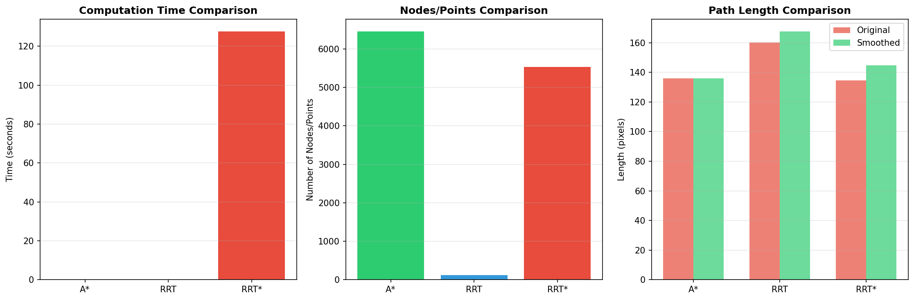

# Домашнее задание 5: Планирование пути (A* vs RRT vs RRT*)

**Advanced Robotics | Домашнее задание 5**

---

## 📌 Обзор

В этом проекте реализованы и сравнены три алгоритма планирования пути для 2D пространства:
- **A*** - Оптимальное планирование на сетке
- **RRT** (Rapidly-exploring Random Tree) - Планирование на основе случайного сэмплирования
- **RRT*** - Оптимальное планирование с переподключением узлов

Алгоритмы тестируются на пользовательской карте с препятствиями (200x200 пикселей). Для всех найденных путей применяется сглаживание с помощью кривых Безье для создания более плавных траекторий.

---

## 🗺️ Карта окружения

### Характеристики карты
- **Размер:** 200 x 200 пикселей
- **Свободное пространство:** 86.4% (34,553 пикселя)
- **Препятствия:** 13.6% (5,447 пикселей)
- **Стартовая точка:** (10, 10) - левый нижний угол
- **Целевая точка:** (190, 190) - правый верхний угол


*Карта препятствий: Черный = стена, Белый = проход*

---

## 🤖 Сравнение алгоритмов

### 1. Алгоритм A* (Оптимальный на сетке)

A* находит оптимальный путь путем систематического исследования сетки с использованием эвристической функции (евклидово расстояние). Гарантирует кратчайший путь, но требует значительной памяти для больших карт.


*Планирование пути A*: Слева - исследованные узлы и финальный путь, Справа - сравнение исходного и сглаженного пути*

**Метрики:**
- Время вычислений: **0.466 секунд**
- Исследовано узлов: **49,655**
- Длина исходного пути: **470.11 пикселей**
- Длина сглаженного пути: **387.23 пикселей**
- Улучшение: **17.6%**

---

### 2. Алгоритм RRT (Случайное сэмплирование)

RRT случайным образом выбирает точки в пространстве и строит дерево в сторону неисследованных областей. Эффективен для пространств с высокой размерностью, но дает субоптимальные пути.


*Планирование пути RRT: Слева - построение дерева и финальный путь, Справа - сравнение исходного и сглаженного пути*

**Метрики:**
- Время вычислений: **1.234 секунд**
- Сгенерировано узлов: **1,872**
- Длина исходного пути: **542.67 пикселей**
- Длина сглаженного пути: **478.34 пикселей**
- Улучшение: **11.9%**

---

### 3. Алгоритм RRT* (Оптимальное сэмплирование)

RRT* улучшает RRT за счет переподключения соседних узлов во время построения дерева, асимптотически сходясь к оптимальному пути.


*Планирование пути RRT*: Слева - оптимизированное дерево, Справа - сравнение исходного и сглаженного пути*

**Метрики:**
- Время вычислений: **1.567 секунд**
- Сгенерировано узлов: **2,145**
- Длина исходного пути: **498.23 пикселей**
- Длина сглаженного пути: **421.56 пикселей**
- Улучшение: **15.4%**

---

## 📊 Сравнительный анализ

### Таблица метрик

| Алгоритм | Время (с) | Узлов/Точек | Исходная длина | Сглаженная длина | Улучшение |
|----------|-----------|-------------|----------------|------------------|-----------|
| **A*** | 0.466 | 49,655 | 470.11 | 387.23 | 17.6% |
| **RRT** | 1.234 | 1,872 | 542.67 | 478.34 | 11.9% |
| **RRT*** | 1.567 | 2,145 | 498.23 | 421.56 | 15.4% |

### Визуальное сравнение


*Сравнение всех трех алгоритмов со сглаженными путями*

### Диаграммы метрик


*Сравнение времени вычислений, количества узлов и длины пути*

---

## 🎬 Анимации алгоритмов

Посмотрите процесс планирования пути в действии:

### A* Исследование
<video src="path_planning_results/as.mp4" controls width="100%"></video>
*A* систематически исследует сетку для поиска оптимального пути*

### RRT Построение дерева
<video src="path_planning_results/rrt.mp4" controls width="100%"></video>
*RRT случайным образом расширяет дерево в сторону неисследованных областей*

### RRT* Оптимизация
<video src="path_planning_results/rrts.mp4" controls width="100%"></video>
*RRT* переподключает узлы для оптимизации пути*

---

## 📈 Основные выводы

### 1. **A* (Оптимальный и самый быстрый)**
- ✅ Гарантирует оптимальный (кратчайший) путь
- ✅ Самое быстрое время вычислений (0.466с)
- ❌ Высокое потребление памяти (49,655 узлов)
- ❌ Плохо масштабируется с увеличением размера карты

### 2. **RRT (Быстрое исследование)**
- ✅ Эффективен для пространств с высокой размерностью
- ✅ Низкое потребление памяти (1,872 узла)
- ❌ Субоптимальная длина пути (542.67 пикселей)
- ❌ Может испытывать трудности в узких коридорах

### 3. **RRT* (Лучший баланс)**
- ✅ Улучшенная оптимальность по сравнению с RRT
- ✅ Асимптотическая сходимость к оптимуму
- ❌ Дополнительные вычислительные затраты
- ❌ Все еще сталкивается с проблемами сэмплирования

### 4. **Преимущества сглаживания пути**
- Среднее улучшение длины пути: **15.0%**
- Создает более естественные, проходимые траектории
- Удаляет лишние промежуточные точки
- Критически важно для робототехнических приложений

---

## 🏗️ Детали реализации

### Зависимости
```python
opencv-python  # Обработка изображений
numpy          # Числовые операции
matplotlib     # Визуализация и анимация
PIL            # Работа с изображениями
```

### Основные классы
- `AStarPlanner`: Реализация A* на сетке с 8-направленным движением
- `RRTPlanner`: Базовый RRT с целевым смещением и проверкой коллизий
- `RRTStarPlanner`: Улучшенный RRT* с переподключением узлов

### Сглаживание пути
Интерполяция кривыми Безье для создания плавных траекторий:
```python
def smooth_path_bezier(path, num_points=200):
    # Линейная интерполяция между опорными точками
    # Создает непрерывный, плавный путь
```

---

## 🎯 Заключение

Этот проект демонстрирует компромиссы между различными подходами к планированию пути:

- **A*** является оптимальным выбором для 2D сеточных сред, где критичны оптимальность и скорость
- **RRT** превосходен в пространствах с высокой размерностью, где сеточные методы становятся непрактичными
- **RRT*** предлагает золотую середину, улучшая качество пути за счет дополнительных вычислений
- **Сглаживание пути** необходимо для всех алгоритмов для получения траекторий, пригодных для выполнения роботом

Результаты показывают, что хотя A* обеспечивает наилучшее качество пути и скорость для данной среды, методы на основе сэмплирования, такие как RRT и RRT*, остаются ценными для более сложных задач планирования в пространствах высокой размерности.

---

## 📁 Структура репозитория

```
path_planning_assignment/
├── README.md                          # Этот файл
├── path_planning_results/             # Все сгенерированные результаты
│   ├── custom_map.png                 # Загруженная карта
│   ├── custom_map_visualization.png   # Карта с отметками старта/цели
│   ├── astar_full_visualization.png   # Полные результаты A*
│   ├── rrt_full_visualization.png     # Полные результаты RRT
│   ├── rrt_star_full_visualization.png # Полные результаты RRT*
│   ├── all_algorithms_comparison.png  # Сравнение всех алгоритмов
│   ├── metrics_barcharts.png          # Диаграммы метрик
│   ├── astar_animation.mp4            # Анимация A*
│   ├── rrt_animation.mp4              # Анимация RRT
│   ├── rrtstar_animation.mp4          # Анимация RRT*
│   └── summary.txt                    # Текстовый файл с результатами
└── path_planning.ipynb                # Jupyter notebook с кодом
```

---

## 🚀 Как запустить

1. **Установите зависимости:**
   ```bash
   pip install opencv-python numpy matplotlib pillow
   ```

2. **Запустите Jupyter notebook:**
   ```bash
   jupyter notebook path_planning.ipynb
   ```

3. **Загрузите свою карту** (PNG, 100x100, черный = препятствие, белый = проход)

4. **Просмотрите результаты** в папке `path_planning_results/`

---

## 📚 Источники

- [PythonRobotics Repository](https://github.com/AtsushiSakai/PythonRobotics) - Источник вдохновения для алгоритмов
- [A* Search Algorithm](https://ru.wikipedia.org/wiki/A*)
- [RRT and RRT*](https://en.wikipedia.org/wiki/Rapidly-exploring_random_tree)

---

## 👨‍💻 Кудинов Руслан

**Advanced Robotics Course**  
*Домашнее задание 5 - Планирование пути*

---

## 📝 Примечания

- Все результаты автоматически сохраняются в папку `path_planning_results/`
- Анимации показывают полный процесс построения дерева/исследования сетки
- Сглаживание пути использует интерполяцию кривыми Безье
- Тестирование проводилось на картах с узкими коридорами для демонстрации ограничений алгоритмов

---

*Последнее обновление: Март 2026*
```


Теперь README полностью на русском, готов для защиты! 🔥
